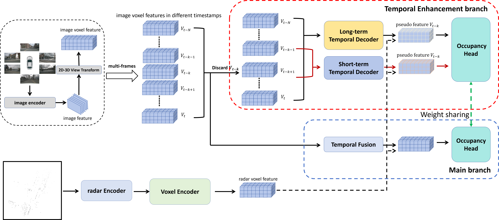

# TEOcc: **Radar-camera Multi-modal Occupancy Prediction via Temporal Enhancement**

This is the official implementation of ECAI 2024 paper: **TEOcc: Radar-camera Multi-modal Occupancy Prediction via Temporal Enhancement**.


## Introduction

As a novel 3D scene representation, semantic occupancy has gained much attention in autonomous driving. However, existing occupancy prediction methods mainly focus on designing better occupancy representations, such as tri-perspective view or neural radiance fields, while ignoring the advantages of using long-temporal information. In this paper, we propose a radar-camera multi-modal temporal enhanced occupancy prediction network, dubbed TEOcc. Our method is inspired by the success of utilizing temporal information in 3D object detection. Specifically, we introduce a temporal enhancement branch to learn temporal occupancy prediction. In this branch, we randomly discard the $t-k$ input frame of the multi-view camera and predict its 3D occupancy by long-term and short-term temporal decoders separately with the information from other adjacent frames and multi-modal inputs. Besides, to reduce computational costs and incorporate multi-modal inputs, we specially designed 3D convolutional layers for long-term and short-term temporal decoders. Furthermore, since the lightweight occupancy prediction head is a dense classification head, we propose to use a shared occupancy prediction head for the temporal enhancement and main branches. It is worth noting that the temporal enhancement branch is only performed during training and is discarded during inference. Experiment results demonstrate that TEOcc achieves state-of-the-art occupancy prediction on nuScenes benchmarks. In addition, the proposed temporal enhancement branch is a plug-and-play module that can be easily integrated into existing occupancy prediction methods to improve the performance of occupancy prediction.




## Weight

* Model weights for TEOcc are released: [google drive](https://drive.google.com/file/d/1VHKlItqn6bMmNJW1IZbL6-QiZcHiJmnw/view?usp=sharing)


## Environment

The code is tested in the following two environment:

```
python                       3.8.13
cuda                         12.1
pytorch                      2.0.1+cu118
torchvision                  0.15.2+cu118
numpy                        1.23.4
mmcv-full                    1.6.0
mmcls                        0.25.0
mmdet                        2.28.2
nuscenes-devkit              1.1.11
av2                          0.2.1
detectron2                   0.6
(for A800 or A40 + cuda 12.1)
```

```
python                       3.8.13
cuda                         11.6
pytorch                      1.12.1+cu116
torchvision                  0.13.0+cu116
numpy                        1.19.5
mmcv-full                    1.6.2
mmcls                        1.0.0rc1
mmdet                        2.24.0
nuscenes-devkit              1.1.9
detectron2                   0.6
(for other GPUs + cuda 11.6)
```

If you encounter slow download speed or timeout when downloading dependency packages, 
you need to consider installing the dependency packages from the mirror website first, 
and then execute the installation:

```bash
pip install -r requirements.txt -i https://pypi.tuna.tsinghua.edu.cn/simple
pip install {Find the dependencies in setup.py:setup(install_requires=[...]) and write them down here} -i https://pypi.tuna.tsinghua.edu.cn/simple
python setup.py develop
```

The most recommended installation steps are:

1. Create a Python environment. Install [PyTorch](https://pytorch.org/get-started/previous-versions/)
   corresponding to your machine's CUDA version;

2. Install [mmcv](https://github.com/open-mmlab/mmcv) corresponding to your PyTorch and CUDA version;

3. Install other dependencies of mmdet and install [mmdet](https://github.com/open-mmlab/mmdetection);

4. Install other dependencies of this project (Please change the spconv version
   in the requirements.txt to the CUDA version you are using) and setup this project;

5. Compile some operators manually.

```bash
cd mmdet3d/ops/csrc
python setup.py build_ext --inplace
cd ../deformattn
python setup.py build install
```


## Data Preparetion

If your folder structure is different from the following, you may need to change the corresponding paths in config files.

```
├── mmdet3d
├── tools
├── configs
├── data
│   ├── nuscenes
│   │   ├── maps
│   │   │   ├── basemap
│   │   │   ├── expansion
│   │   │   ├── prediction
│   │   │   ├── *.png
│   │   ├── samples
│   │   ├── sweeps
│   │   ├── v1.0-test
|   |   ├── v1.0-trainval
│   │   ├── gts # Occ3D-nuScenes
```

For TEOcc, prepare nuscenes data by running

```bash
python tools/create_data_nuscenes_RC.py
```


## Testing

```bash
./tools/dist_test.sh $config_path $checkpoint_path $gpus --eval bbox
```


## Acknowledgements

The overall code are based on [mmdetection3D](https://github.com/open-mmlab/mmdetection3d), [BEVDet](https://github.com/HuangJunJie2017/BEVDet) and [SparseBEV](https://github.com/MCG-NJU/SparseBEV/tree/main). We sincerely thank the authors for their great work.


## License

The project is only free for academic research purposes, but needs authorization for commerce. For commerce permission, please contact wyt@pku.edu.cn.
